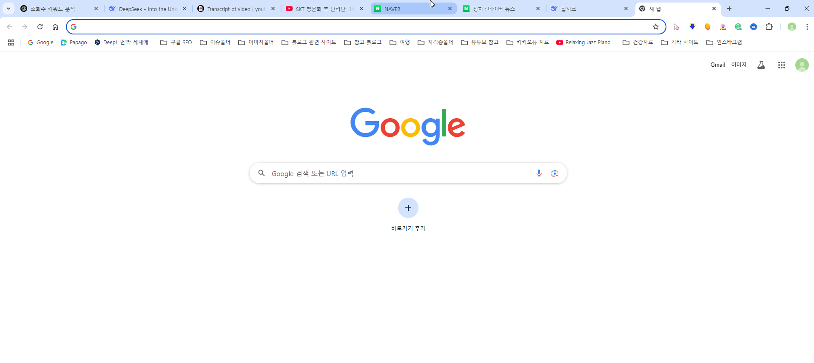
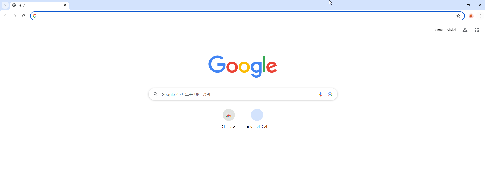

오전 8:01 티스토리거참 은행 계좌는 동일 계좌 사용해도 되나요? 
오전 8:40 엄지척 프로도 다계정이면 같은 은행이라도 같은 계좌 사용은 절대 안됩니다. 예금주 같아도
오전 8:59 티스토리거참 감사합니다~ 제 명의의 새로운 계좌로 해야겠네요
오전 9:43 엄지척 프로도 크롬 사용자 분리 필수로 하시고요, 1개 사용후 로그아웃하고 크롬 우측 상단 설정 들어가서 계정삭제 반드시 클릭합니다. 그리고 쿠키 모두 삭제하세요.

그리고 1개 크롬에만 북마크, 크롬 확장 프로그램 등록하세요.
오전 9:44 엄지척 프로도 사진 2장

오전 9:47 엄지척 프로도 이건 기초 중의 기초입니다. 왜냐하면 구글은 크롬과 모바일 휴대폰이 안드로이드인 경우 대다수 데이터를 수집하고 있기 때문입니다. 휴대폰에 구글 애드센스 계정과 연동되는 지메일로 가입한 경우 휴대폰이 와이파이 작동하고 피시가 같은 아이피로 작동한다면 ㅎㅎ 이건 누가 봐도 모두 알게 되는 이치입니다. 전 왠만하면 휴대폰과 연동되는 구글 애드센스 계정이 아닌 다수 게정 접속 시 휴대폰 아이피 차단합니다.
오전 9:49 엄지척 프로도 저는 지금껏 오랜 기간 블로그를 하였지만, 계정이 해지되는 불행한 일은 절대 없었습니다. 이런 귀찮은 일들을 최소 7년 넘도록 실천하고 습관처럼 행동합니다. 물론 항상 검색마다 모바일 삼성 인터넷과 구글 크롬도 모두 삭제합니다.^^
오전 9:56 티스토리거참 조언 감사합니다
오전 10:14 티스토리거참 해지 당해보니 멘탈 잡기가 어렵네요 ㅎ 원인도 정확히 알기는 어렵지만 오래된 계정이었다 보니 정책 이슈가 있을 만한 컨텐츠가 있었을 거라고 봅니다 ㅜㅜ 다음 운영 시에는 FM 으로 운영하려고요. 아내 계정으로 해보려고 하는데 애센 다계정 생성, 운영에만 차질이 없기를 바라는 마음입니다
오전 10:15 엄지척 프로도 최초 주소와 살짝만 다르게 하면 핀번호 받는데 문제 없습니다.
오전 10:16 엄지척 프로도 처음에 구주소 2차 아파트 305호라면, 이번에 신주소 적으면 됩니다.
오전 10:17 티스토리거참 감사해요ㅎ 이사를 몇번 해서 다행히
오전 10:29 엄지척 프로도 도움이 되었으면 합니다.^^
